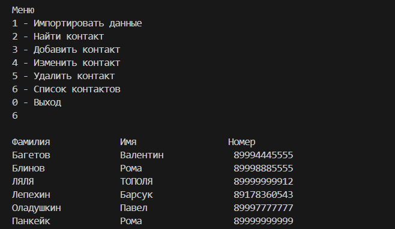

# Итоговая контрольная работа по основному блоку Python
## Tелефонный справочник с SQL

### Необходимые действия:

1. Создать репозиторий на GitHub.
2. Снабдить репозиторий оформленным текстовым описанием решения (файл README.md).
3. Сделать консольное приложение: Телефонный справочник с внешним хранилищем информации. Реализовать основной функционал - просмотр, сохранение, импорт, поиск, удаление, изменение данных.

### Решение:

1. Создан репозиторий: **phonebook**

2. Текстовое описание решения (файл **README.md**)

3. Используется база данных SQLite (файл **proba.db**)

4. Программа находится в ветке [`main`](https://github.com/Kutlubaeva6/Phone/blob/main/main.py "Открыть решение")

5. Пояснение по чтению кода:

1 строка:
Этот код импортирует модуль `sqlite3` и задает ему псевдоним `sl`. Модуль `sqlite3` - это стандартный модуль Python, который обеспечивает интерфейс для работы с базами данных `SQLite`.

3-29 строки:
Функция `menu` реализует текстовое меню для управления базой данных контактов через консоль. Она включает в себя следующие действия:

1. **Импорт данных**: Позволяет пользователю загрузить контакты из файла.
2. **Поиск контакта**: Поиск конкретного контакта в базе.
3. **Добавление контакта**: Добавление нового контакта.
4. **Изменение контакта**: Редактирование данных существующего контакта.
5. **Удаление контакта**: Удаление контакта из базы.
6. **Просмотр списка контактов**: Отображение всех контактов.
7. **Выход**: Завершение работы программы.

После каждой операции, изменяющей данные, происходит сохранение изменений в базе данных с помощью `conn.commit()`. Функция использует бесконечный цикл, который завершается только при выборе опции "Выход".


32-41 строки:
Функция `import_data` служит для импорта данных из текстового файла в базу данных. Она принимает два аргумента: путь к файлу `file_to_add` и соединение с базой данных `conn`. Функция пытается открыть указанный файл, читает его построчно и для каждой строки выполняет SQL-запрос на добавление данных в таблицу `phone` базы данных. В случае, если файл не найден, выводится соответствующее сообщение об ошибке.


43-51 строки:
Функция `read_file` считывает данные из файла, имя которого передается в параметре `file_name`. Она открывает файл, читает его построчно и преобразует каждую строку в словарь, где ключи — это заголовки 'Фамилия', 'Имя' и 'Номер телефона'. Все словари собираются в список, который возвращается функцией. Это позволяет организовать прочитанную информацию в структурированный вид для дальнейшей обработки.


54-68 строки:
Функция ```search_parameters``` запрашивает у пользователя параметр поиска (фамилия, имя или номер) и соответствующее значение этого параметра. Пользователь выбирает тип параметра, а затем вводит соответствующее значение. Функция возвращает выбранный тип параметра и введенное значение для дальнейшего использования в программе.


71-83 строки:
Функция ```find``` осуществляет поиск контактов в базе данных телефонов по заданным параметрам, таким как фамилия, имя или номер. Он формирует SQL-запрос на основе введенных пользователем параметров, выполняет его и выводит найденные контакты. Если контакты не найдены, он выдает сообщение об этом.


86-90 строки:
Функция ```get_new``` запрашивает у пользователя фамилию, имя и номер телефона, сохраняет их и возвращает как словарь.


93-96 строки:
Функция ```add``` добавляет новую запись в базу данных. Она использует курсор для выполнения SQL-запроса вставки данных в таблицу `phone`. Параметры для вставки берутся из результата функции `get_new()`, которая возвращает словарь с данными. После выполнения операции изменения сохраняются в базе данных с помощью `commit()`.
об этом.


99-105 строки: 
Функция `show` выводит данные из таблицы `phone` базы данных `SQLite`. Она форматирует заголовки и строки таблицы, выравнивая их по столбцам. В основе работы функции лежит SQL-запрос, который выбирает все строки из таблицы и сортирует их по фамилии.
об этом.



108-125 строки:
Функция ```search_to_modify``` выполняет поиск записей в базе данных телефонных контактов в зависимости от введенных пользователем параметров поиска и возвращает результаты. Он использует SQL-запросы для поиска записей, а затем возвращает соответствующий результат пользователю.


128-146 строки:
Функция ```change``` принимает подключение к базе данных и позволяет пользователю выбрать поле для изменения (Фамилия, Имя или Номер телефона). Затем она запрашивает новое значение этого поля у пользователя и обновляет запись в базе данных соответственно.
об этом.


149-154 строки:
Функция ```delete``` удаляет запись из базы данных SQLite. Она получает информацию о записи для удаления, затем выполняет SQL-запрос DELETE, используя эту информацию.
об этом.


157-161 строки: 
Функция ```print_contacts``` выводит информацию о контактах. Она принимает список контактов в виде списка словарей. Для каждого контакта функция выводит на экран все пары ключ-значение из словаря контакта, выравнивая значения по ширине 12 символов.


164-166 строки:
Код предназначен для открытия соединения с базой данных ```SQLite``` и вызова функции menu, которая предоставляет пользователю варианты работы с базой данных.


